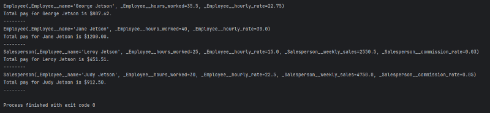

## Employees - Polymorphism

### Instructions:

#### Create Dataclasses
- In a file called employee.py, create a dataclass that represents an Employee. The dataclass should contain the following:
  - Attributes for the Employee’s name, hours worked and hourly rate.
  - The dataclass should contain properties to set and get all attributes. 
  - The dataclass should contain a calc_pay method that calculates and returns the Employee’s pay.
    - An Employee’s pay is equal to the number of hours worked times their hourly rate.

- Create a subclass of Employee named Salesperson. The dataclass should contain the following:
  - Attributes for the Salesperson’s weekly sales and commission percentage.
  - The dataclass should contain properties to get and set its instance variables. 
  - The class should contain a calc_pay method that calculates and returns the Salesperson’s pay.
    - A Salesperson’s pay is equal to their pay as an Employee plus amount of commission earned all sales made (commission percent x sales).

#### Testing
- The main class will create two instances from your Employee class and two instances from your Salesperson class
  - Do not modify the code for creating the instances of those classes
  - If something doesn't work in that section, the problem is in the classes you created.

#### Demonstrate Polymorphism
- In the bottom section of the main program do the following:
  - Add all four instances of people to a single list (This works because of polymorphism)
  - Use a single for loop to print the data from each object and the results of the calc_pay method for each of them.
  - See the example below.

- Enter your name, the lab number, and the current date into a set of comments at the top of the code.	
- Push the program source code to the assignment repo. 

### Example Output

### Evaluation:
- General, compiles, comments, proper indentation, etc  
- Employee dataclass
- Employee dataclass properties  
- Employee dataclass pay calculation
- Salesperson dataclass   
- Salesperson dataclass properties  
- Salesperson dataclass pay calculation  
- Objects used in a for list
- Output matches example
